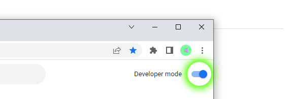
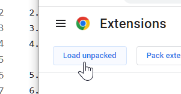
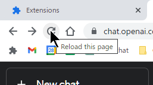

    <h6>
        <picture>
            <source type="image/svg+xml" media="(prefers-color-scheme: dark)" srcset="https://cdn.jsdelivr.net/gh/KudoAI/chatgpt.js@e638eac/assets/images/icons/earth/white/icon32.svg">
           
        </picture>
        &nbsp;Deutsch |
        <a href="../..#readme">English</a> |
        <a href="../zh-cn#readme">简体中文</a> |
        <a href="../zh-tw#readme">繁體中文</a> |
        <a href="../ja#readme">日本</a> |
        <a href="../ko#readme">한국인</a> |
        <a href="../hi#readme">हिंदी</a> |
        <a href="../es#readme">Español</a> |
        <a href="../fr#readme">Français</a> |
        <a href="../it#readme">Italiano</a> |
        <a href="../nl#readme">Nederlands</a> |
        <a href="../pt#readme">Português</a> |
        <a href="../vi#readme">Việt</a>
    </h6>

#  chatgpt.js-chrome-starter

<h3>Ein Ausgangspunkt für die Entwicklung Ihrer eigenen Chrome-Erweiterung mit <a href="https://github.com/KudoAI/chatgpt.js/#readme">chatgpt.js</a></h3>

 

## ⚡ Installation

1. Klicken **Fork** -oder- **Use this template** > **Create a new repository** an https://github.com/KudoAI/chatgpt.js-chrome-starter

2. **Clone** ihr neu erstelltes Repo lokal

3. Besuchen Sie `chrome://extensions` in Chrome (oder einem anderen Chromium-Browser)

4. Stellen Sie sicher, dass der Schalter **Developer mode** aktiviert ist 

5. Klicken **Load unpacked**  

 

6. Wählen Sie im Popup-Fenster den Ordner **extension** aus > klicken **Select Folder**   
  

Das ist es! **ChatGPT Extension** erscheint nun in der Erweiterungsliste:

 

 

**💡 TIPP:** _Um Änderungen gegenüber dem Quellcode widerzuspiegeln, klicken Sie auf der Erweiterungskachel auf **Neu laden** und auf neu laden alle Chrome-Tabs-Erweiterungsskripts, die ausgeführt werden auf:_

 

 

_Erweiterte Chrome-API-Methoden finden Sie unter: https://developer.chrome.com/docs/extensions/reference/api_

## 🤖 Erstellt mit chatgpt.js

Dies sind einige der von Google angebotenen Erweiterungen, die chatgpt.js verwenden:

 

 

#

<a href="https://github.com/KudoAI/chatgpt.js-chrome-starter/issues">Hilfe bekommen</a> / <a href="#top">Zurück nach oben ↑</a>
